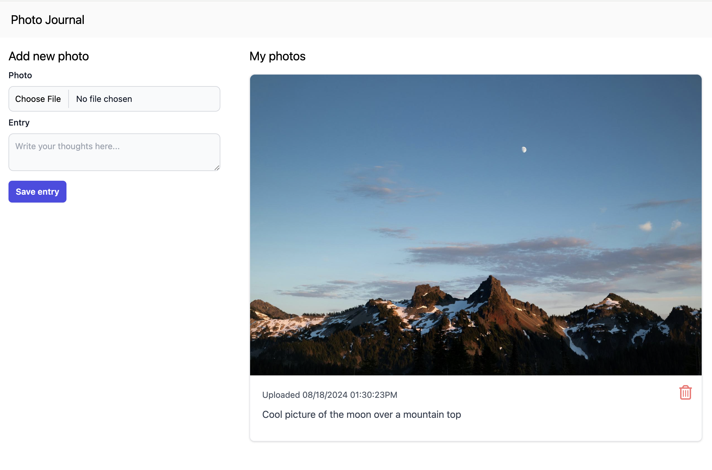

# The Big One: Full-stack Project

## Description

Throughout this quarter, you’ve learned many tools and techniques for backend or server-side web and API development with Python. You’ve also learned to containerize and deploy your Python code to the Internet where it can be accessed by users and consumed by other software. 

Even for primarily server-side web programmers, it is very important to have a basic working knowledge of frontend web technologies such as [HTML](https://developer.mozilla.org/en-US/docs/Glossary/HTML), [CSS (Cascading Style Sheets)](https://developer.mozilla.org/en-US/docs/Glossary/CSS) and [JavaScript](https://developer.mozilla.org/en-US/docs/Glossary/JavaScript). At this point in the course, you’ve had a chance to learn the basics of HTML by developing a web scraper API in lesson 5, and by writing web-based documentation for your Django API assignment in lesson 6. For this assignment you will build on that foundation to develop a full-stack web application, using Python and FastAPI for your backend code, and a combination of the Jinja HTML templating engine, the TailwindCSS framework and the htmx JavaScript library. 

The great thing about this particular stack of web development technologies is that they allow you to create modern, highly interactive web applications using primarily Python and HTML rather than a complex JavaScript framework such as React, Angular or VueJS for the frontend code. The Jinja templating engine allows you to use Python syntax directly in HTML template files to programmatically generate web pages. TailwindCSS gives you the ability to style your web pages with CSS utility classes directly in your HTML markup. And htmx allows you to make [AJAX (Asynchronous JavaScript and XML)](https://developer.mozilla.org/en-US/docs/Glossary/AJAX) calls to your server-side code using only HTML attributes rather than JavaScript so individual HTML elements can be updated dynamically without rebuilding the entire web page on each HTTP request. What all this means for web developers is that you can do more with a lot less code when it comes to building modern, interactive web applications.

For most of the assignments this quarter, you’ve been building projects from scratch or from fairly minimal starter templates. However, for this final full-stack project, you will be adding new features to an existing web application using the technologies introduced above. In real-world web development it is rare to have the opportunity to work on building a greenfield project from the ground up, and much more common to add features and fix bugs in an existing code base. It is also part of the job to quickly learn new technologies, frameworks and libraries and put them to use in your company’s projects. The goal of this assignment is to give you an opportunity to explore the world of full-stack web development in a hands-on way while leveraging your Python skills and increasing your growing knowledge of HTML and related web-technologies.

### Prerequisites

In order to follow the instructions for the assignment below, it is highly recommended that you familiarize yourself with the following documentation and learning resources and use them as a reference while working on the project.

**Documentation**

- [FastAPI *Templates* documentation](https://fastapi.tiangolo.com/advanced/templates/)
- [Jinja Templating Engine documentation](https://jinja.palletsprojects.com/en/3.1.x/)
- [htmx documentation](https://htmx.org)
- [jinja2-fragments documentation (README)](https://github.com/sponsfreixes/jinja2-fragments)
- [TinyDB documentation](https://tinydb.readthedocs.io/en/latest/)
- [TailwindCSS documentation](https://tailwindcss.com/docs/installation) 

NOTE: the TailwindCSS documentation is extensive, and you'll only be doing a small amount of customization of Tailwind utility classes for this assignment. I'd recommend reading through the Core Concepts section to familiarize yourself with the framework, and then using the rest of the docs as reference as needed

**Additional learning resources**

- [FastAPI with htmx tutorial](https://testdriven.io/blog/fastapi-htmx/)
- [FastAPI with htmx and Tailwind PyCon presentation](https://www.youtube.com/watch?v=YUoflPpVLjQ)
- [GitHub Repo with sample code for the PyCon talk above](https://github.com/tataraba/musicbinder) 

### Photo Journal Web App

Imagine you’ve just been hired by a hot new startup to work on the [MVP (Minimum Viable Product)](https://en.wikipedia.org/wiki/Minimum_viable_product) release of their new web app 'Photo Journal'. Photo Journal is an app that lets its users upload photos to a personal web page along with dedicated journal entries for each photo (sort of like Instagram for one). They’ve already chosen their tech stack, and started work on the project, but the first web developer they hired just left to work for their competitor Picture Diary. So now it’s up to you to finish the job!

The existing code for this project is stored in the `photo_journal_app` folder in this repository. Open `photo_journal_app/main.py` to take a look at the initial FastAPI that was written for the project. Scroll down to the `# FastAPI routes` Python comment, and you'll see two FastAPI route functions. The first function named `photo_journal` processes GET requests to the web app's root URL and returns an HTML response of the full HTML page to display in the web browser. The second `post_photo` function allows users to upload image files and journal entries via an asynchronous POST request to the `/post-photo` URL. It uses the Python Image Processing library [Pillow](https://pillow.readthedocs.io/en/stable/) to ensure that the uploads are valid image files, and to resize the image to an optimal resolution for display on the web. Image files are then stored on the server in the `/static/images` folder and a database record is created for the image file location, journal entry and a time stamp for ordering images by how recently they were uploaded. 

After processing the image and storing this data, the `post_photo` function uses the [`jinja2-fragments`](https://github.com/sponsfreixes/jinja2-fragments) library along with htmx to update only the `photos` block of the web page's HTML to display the newly uploaded photo, rather than refreshing the entire page. To see how this works, open the `templates/photo_journal.html.jinja2` file and take a look at the htmx code in the `form` tag on line 24 under the 'Add new photo' heading. The `hx-post` attribute defines the URL route to send a request to on the server, in this case it's the `/post-photo` route from the `post_photo` FastAPI function. The `hx-target` attribute indicates which HTML element to update with the response from the server. The `#` symbol is a convention used to indicate an HTML `id` attribute, so the `#photos` value in combination with the `hx-swap="innerHTML"` attribute tells htmx to replace the inner HTML content inside the `
` HTML element on line 53 with the response from the server. That response is the return value of the `post_photo` function: `templates.TemplateResponse(name="photo_journal.html.jinja2", context=context, block_name="photos")` which uses a `jinja2-fragments` `TemplateResponse` object to return only the code in the `photos` block of the `photo_journal.html.jinja2` template.

### Running the App Locally

To see this code in action, start up a local development server and test out the current version of the app in your web browser. Begin by creating and activating a new virtual environment for the project's dependencies. Then, from the `photo_journal_app` folder, run `pip install -r requirements.txt` to install those dependencies. Since this project uses TailwindCSS for styling its HTML, you need to run the following command to generate a stylesheet (and to pick up any changes you make to the CSS utility classes in your HTML template files): `tailwindcss -i static/src/tw.css -o static/css/styles.css --watch`. You will also need to create a new `images` folder inside the `photo_journal_app/static/` folder for storing your uploaded images (this folder is included in your project's `.gitignore` file so its contents are not tracked in version control). Then you can start your local FastAPI development server in another terminal window with the `fastapi dev main.py` command. Now go to `http://127.0.0.1:8000` in your computer's web browser, and you should see the home screen of the Photo Journal app. Go ahead and use the 'Add new photo' form to upload an image file from your computer along with a journal entry, and you should see your photo displayed in the 'My photos' section of the web page. 

### Automated Tests

Along with the FastAPI code in the `main.py` file, the Jinja template code in the `templates` folder and the TailwindCSS code and images stored in the `static` directory, you will also find a `test_main.py` file with some test functions in the `photo_journal_app` folder. Run the tests with the `pytest` command from that folder and you should see two passing tests for the GET and POST FastAPI routes in `main.py`, as well as three test failures. It seems that the previous developer who worked on this project was a staunch proponent of test-driven development and has already written tests for features that are not implemented yet. It will be your job to get these tests to pass. 

### New Feature Requests

On your first day on the job at Photo Journal, you are tasked with four new feature requests:

**Add the ability to edit journal entries**

For this feature, you will implement the [click to edit](https://htmx.org/examples/click-to-edit/) example from the htmx documentation to allow users to edit their photo journal entries by clicking on the journal entry text. Begin by creating two new FastAPI router functions: `get_edit_photo_form()` for processing GET requests to the `/edit-photo` URL and `edit_photo()` for processing POST requests to the same URL. When a GET request is made to this URL with htmx, the `get_edit_photo_form()` function will return a partial HTML template with a form to edit the entry. This form will replace the journal entry text on the web page, and allow users to edit the entry. When they submit the form, it will make a POST request to the `/edit-photo` URL invoking the `edit_photo()` function which will update the photo journal database record with the edited entry and return HTML with the updated content. 

In `photo_journal.html.jinja2` each `
` element that contains the journal entry content is wrapped in a `div` tag with the following markup:

`
`

This code uses Jinja context variables to give every photo journal entry a unique id, which you can send back to the server to indicate which record to update in the database. But first you'll need to provide your user with an HTML form to edit the journal entry. In order to do this, use htmx to make a GET request to the `/edit-photo` URL when the user clicks on the `
` element containing the journal entry. Use the `hx-target` and `hx-swap` attributes to replace the entire `
` element with the HTML response from the server. Note that you can use the `hx-vals` attribute to pass GET request data in JSON format, similarly to the form data from the POST request for the existing `post_photo()` function. This would be a good way to pass the photo ID value as a parameter to the `get_edit_photo_form()` function which it can then use to create an HTML form for modifying this specific photo. 

Your `get_edit_photo_form()` function can then use the ID value to retrieve the correct photo record from the database and return it as a context variable along with an HTML form for editing the entry. You can use the existing HTML code from the image upload form as an example for what your HTML form might look like. However, your form should use htmx to issue a POST request back to the `/edit-photo` URL with the edited entry field and replace itself with the updated content. Your form should also include a hidden HTML form field for sending the photo ID back to the server that looks like this:

`<input name="photo_id" type="hidden" value="{{ photo.doc_id }}">`

Be sure to include a parameter on your `edit_photo()` function for accepting the ID like this `photo_id: Annotated[int, Form()]`. Then you can use the ID value in your function to update the correct record in the database and return the original `
` element with the updated entry to replace the form on the web page. One way to do this without duplicating any template code would be to wrap the original `
` element from `photo_journal.html.jinja` with a Jinja `block` tag like this: ``. Then your `edit_photo()` function can use `jinja2-fragments` to update just that block of HTML, similar to the existing `post_photo()` function: `templates.TemplateResponse(name="photo_journal.html.jinja2",, context=context, block_name="click_to_edit_entry")`. 

After implementing this feature as described, you should be able to run the tests and see that the `test_edit_photo()` test is now passing.

**Add the ability to delete photos**

In the current version of the app, there's a little red trashcan icon on each photo journal entry that does nothing when you click it. Add a `delete_photo()` route function to `main.py` that processes DELETE requests to delete photo records from the database, and remove the associated file from the file system with Python's built-in `os.remove()` method. 

For this feature, you can add htmx attributes directly to the `svg` element of the trashcan icon. These attributes should tell htmx to send a DELETE request to the `/delete-photo` endpoint when the user clicks on the icon. Use the `hx-vals` attribute to send the photo ID to the server similarly to your GET request to the `/edit-photo` URL. And use the `hx-swap` attribute along with the photo ID to replace the entire photo `div` with the response from the server. You can then use that ID to delete the proper photo record from the database along with the image file stored on the server. You can use the FastAPI `Response` object to return an empty HTTP body from your `delete_photo()` function like this: `return Response(status_code=200)`.

After you've implemented this feature, the `test_delete_photo()` test should pass along with the others.

**Implement infinite scroll for pagination**

The current version of the app has a glaring flaw. No matter how many photo journal entries you upload to the database, it will always only display the three most recently uploaded images to the page. That's because the original developer had planned to use htmx's [infinite scroll](https://htmx.org/examples/infinite-scroll/) example from the documentation to implement pagination so that only three image files at a time will be loaded from the server as you scroll down the page. 

If you take a look at the `get_sorted_photos()` utility function at the top of the `main.py` file, you'll see that it's written to return a specific slice of the sorted images from the database. When this function is called in the existing `photo_journal()` and `post_photo()` functions, it is provided the following arguments: `get_sorted_photos(db.all(), 0, PHOTOS_PER_PAGE)`. Since the `PHOTOS_PER_PAGE` constant is set to 3, these functions will always return the three most recently uploaded photos. 

For performance reasons, we want our app to load up to three more photos whenever the user scrolls to the last photo that is currently loaded on the screen. In order to do this, create a `load_photos()` function in `main.py` for processing GET requests to the `/load-photos` URL. This function will include a `photo_count` parameter for passing in the current total count of images displayed on the page. On initial page load, this parameter will be set to 3 and can be passed to the the `/load-photos` endpoint as GET request data, similarly to how we passed the photo ID values for the edit and delete functions. The `load_photos()` function can then add the `PHOTOS_PER_PAGE` value to the `photo_count` argument value to calculate a new photo count value to return as a context variable and to query the database for the next chunk of images to load. You can use Jinja's `forloop.last` attribute in the `` loop in combination with the infinite scroll example from the htmx docs to trigger the GET request whenever a user scrolls to the last image that's currently loaded. 

All five tests in the `test_main.py` file should pass after this feature is implemented.

**Make it your own**

The current version of this project uses TailwindCSS utility classes to create a nice clean interface that looks great on different device sizes. But it's also a bit boring. Let's spice things up by modifying or adding TailwindCSS utility classes to give our app a bit more color, customize the font or other CSS styles to make it look a bit more unique. This feature request is more open-ended than the others, so feel free to adjust things as much or as little as you like to give yourself a sense of the ways you can customize your web app's appearance with Tailwind without ever leaving the comfort of an HTML file. And be sure to have Tailwind running in your terminal with the `tailwindcss -i static/src/tw.css -o static/css/styles.css --watch` command to pick up the changes to your HTML file.

## Learning Objectives

* Learn to use FastAPI in combination with Jinja2 templates to create dynamically generated HTML code
* Learn to use htmx with FastAPI and `jinja2-fragments` to update portions of a web page using HTTP verbs and FastAPI router functions and zero JavaScript code
* Learn to implement new features in an existing code base and get existing tests to pass 
* Learn to use TailwindCSS's utility classes to customize a website's CSS styles directly in an HTML file

## Deliverables

Your submission should include everything necessary to execute your code on a local server and to use your app in a web browser.

## Testing your work

There are two main ways in which your code can be tested:

* By running your app on a local server and interacting with it in a web browser
* By using FastAPI's built-in testing capability with PyTest

## Hints

* Remember to first implement _a solution_ before trying to go for _the solution_. Once your code meets all requirements, you can revisit individual features, looking for opportunities for improvement.
* Use the existing FastAPI, Jinja and htmx code as examples for implementing new features along with the documentation and learning resources linked in the prerequisites section above

## Grading Criteria

There are a total of 10 points, divided as follows:

* (1 pt.) Your FastAPI development server launches locally (127.0.0.1) without crashing and your web application runs in a web browser without throwing any errors
* (2 pt.) Your web application allows users to edit photo journal entries and updates the edited content only without refreshing the entire web page
* (2 pt.) Your web application allows users to delete photo journal entries and removes the photos from the web page without triggering a full page refresh
* (2 pt.) Your web application implements an infinite scroll feature where three new images are loaded when the user scrolls to the last image currently loaded on the page
* (1 pt.) All tests in the `test_main.py` file pass without any modification that impacts the features described above
* (1 pt.) Your web application uses TailwindCSS utility classes to implement custom CSS styles 

#### Important Notes

If your code fails to run successfully due to errors or incomplete implementation, your assignment will receive zero points. It is crucial to ensure that your code is complete and free from any errors before submission.
